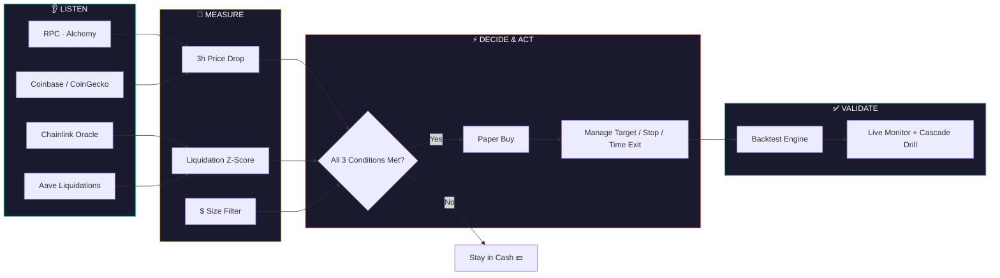

=======
<div align="center">

# 🌊 Cascade Catcher

### A systematic strategy that trades DeFi liquidation cascades — not price direction.

[]()
[]()
[]()
[]()
[]()
[]()

[]()
[]()
[]()
[]()

<p>
  <a href="#-overview">Overview</a> •
  <a href="#️-strategy-logic">Strategy</a> •
  <a href="#-how-it-works">How It Works</a> •
  <a href="#-mathematical-model">Math</a> •
  <a href="#-backtested-performance">Results</a> •
  <a href="#️-risk--failure-conditions">Risk</a> •
  <a href="#-setup">Setup</a>
</p>


</div>

---

## 🔎 Overview

> [!NOTE]
> Cascade Catcher does **not** attempt to predict market direction. It exploits a specific, observable market inefficiency: **forced selling**.

When traders borrow against collateral on lending protocols such as **Aave** and the price falls too far, the protocol automatically liquidates their position — selling collateral at *any* available price. When enough of these forced sales occur together, they trigger a **liquidation cascade**: a chain reaction that pushes price below fair value for a short window before it recovers.

Because every liquidation on Ethereum is recorded publicly on-chain, this forced selling can be **measured directly and traded on** — instead of forecasting where price will go next. The strategy sits in cash the majority of the time and acts only when its entry conditions align.

<div align="center">

| 🟢 In cash ~95% of the time | 🎯 Trades only confirmed forced-selling events | 📉 Every failure mode documented |
|:---:|:---:|:---:|


</div>

---

## ⚙️ Strategy Logic

<table>
<tr>
<td width="50%" valign="top">

### 🟩 Entry — all 3 required

| Condition | Threshold |
|---|---|
| 📉 Price drop | ≥ **4%** in 3 hours |
| 🔺 Liquidation spike | ≥ **3σ** above 7-day avg |
| 💰 Minimum size | ≥ **$1,000,000** in 1 hour |

</td>
<td width="50%" valign="top">

### 🟥 Exit — first trigger wins

| Trigger | Rule |
|---|---|
| 🎯 Target | +50% of crash recovered |
| 🛑 Stop-loss | −6% further drop |
| ⏱️ Time stop | 48h with no rebound |
| 🚫 Circuit breaker | 2 stops in 7 days → pause 1 week |

</td>
</tr>
</table>

<details>
<summary>🧠 <b>Why these thresholds? (click to expand)</b></summary>

<br>

The three-condition filter exists because **buying every dip loses money**. Backtesting showed:

- Buying dips with no liquidation filter → Sharpe **−0.38** ❌
- Buying dips *with* the liquidation filter → Sharpe **+1.33** ✅

The liquidation spike and minimum-size filters are what separate genuine forced-selling cascades from ordinary volatility.

</details>

<div align="center">


</div>

---

## 🔄 How It Works



> [!TIP]
> **Oracle-gap signal:** Chainlink updates its price only after a meaningful move. When the live market price falls well below Chainlink's last reported price, liquidations are likely to fire at the next update — an early warning *before* the cascade starts.

<div align="center">


</div>

---

## 🧮 Mathematical Model

<details>
<summary>📐 <b>Price drop signal</b> (click to expand)</summary>

<br>

$$
\Delta P = \frac{P_{t-3h}^{max} - P_t}{P_{t-3h}^{max}} \times 100\%
$$

Entry requires $\Delta P \geq 4\%$

</details>

<details>
<summary>📊 <b>Liquidation z-score</b></summary>

<br>

Given hourly liquidation volume $L_t$, mean $\mu_L$, and standard deviation $\sigma_L$ over the trailing 7 days:

$$
z_L = \frac{L_t - \mu_L}{\sigma_L}
$$

Entry requires $z_L \geq 3$

</details>

<details>
<summary>⚖️ <b>Position sizing</b> (fixed fractional risk)</summary>

<br>

With account equity $E$, entry price $P_{entry}$, stop price $P_{stop}$, and risk fraction $r = 2\%$:

$$
Q = \frac{r \cdot E}{P_{entry} - P_{stop}}
$$

</details>

<details>
<summary>📈 <b>Sharpe ratio & drawdown</b></summary>

<br>

**Sharpe ratio** (annualized), given strategy returns $r_i$ over $N$ periods and risk-free rate $r_f$:

$$
\text{Sharpe} = \frac{\overline{r} - r_f}{\sigma_r} \times \sqrt{N}
$$

**Maximum drawdown**, given equity curve $E_t$:

$$
\text{MDD} = \min_{t} \left( \frac{E_t - \max_{\tau \leq t} E_\tau}{\max_{\tau \leq t} E_\tau} \right)
$$

</details>

---

## 📊 Backtested Performance

<div align="center">

| Metric | Result | |
|---|---|:---:|
| Return (default run) | **+16%** while market fell 66% | 🟢 |
| Sharpe ratio | **1.45** | 🟢 |
| Max drawdown | **−7%** | 🟡 |
| Profitable across simulated markets | **98%** of 40 runs | 🟢 |

</div>

---

## ⚠️ Risk & Failure Conditions

> [!WARNING]
> Honest risk disclosure is treated as a core requirement of this project — not an afterthought. All trading is **simulated**. No real funds are used at any point.

<details open>
<summary><b>📉 Documented breaking points</b></summary>

<br>

| Condition | Breaking Point | Severity |
|---|---|:---:|
| Crash driven by real news, not forced selling | Above ~77% of cases | 🔴 |
| Trading costs | Above ~0.74% per trade | 🟠 |
| Slow recovery | Longer than ~41 hours | 🟠 |
| Competing capital compresses the edge | Overshoot shrinks toward zero | 🟡 |
| Price gaps past the stop-loss | Loss can exceed 6% | 🔴 |
| Exchange/RPC outage during a crash | Not modelled | 🔴 |

</details>

<div align="center">


</div>

---

## 🏗️ Architecture

<div align="center">

| Layer | Tech |
|---|---|
| 🖥️ Backend |   PGlite · BullMQ · WebSocket |
| 🎨 Frontend |   Candlestick charts with liquidation markers |
| 🔗 Data | Alchemy/Infura RPC · Chainlink · Aave `LiquidationCall` · Coinbase/CoinGecko · Etherscan |


</div>

---

## 🚀 Setup

```bash
git clone <this-repo>
cd cascade-catcher
npm install
npm run demo
```

> [!IMPORTANT]
> Runs the full application — API, worker, database, and frontend — from a single process at `http://localhost:8080`. No Docker, Postgres, or Redis installation required.

<div align="center">


</div>

<details>
<summary>🔑 <b>Enable live Ethereum data (click to expand)</b></summary>

<br>

Add an RPC provider key to `.env`:

```bash
RPC_URLS=https://eth-mainnet.g.alchemy.com/v2/YOUR_KEY,https://ethereum-rpc.publicnode.com
```

</details>

---

## 🧾 Limitations

- ⚠️ Staked-ETH derivatives (wstETH, weETH) are valued at the ETH price.
- ⚠️ Chainlink's update thresholds are assumed, not independently verified.
- ⚠️ Free public RPCs are rate-limited; a keyed provider is recommended for reliable history.
- ⚠️ Backtest results validate the mechanism in simulation; they do not by themselves confirm the edge holds in live markets.

---

<div align="center">

## 📄 License

**MIT** — see [`LICENSE`](LICENSE) for details.

Made with 🌊 for Multipli

</div>
>>>>>>> e64dcb5163081a95c3416a2860932d2179e2a7f8
